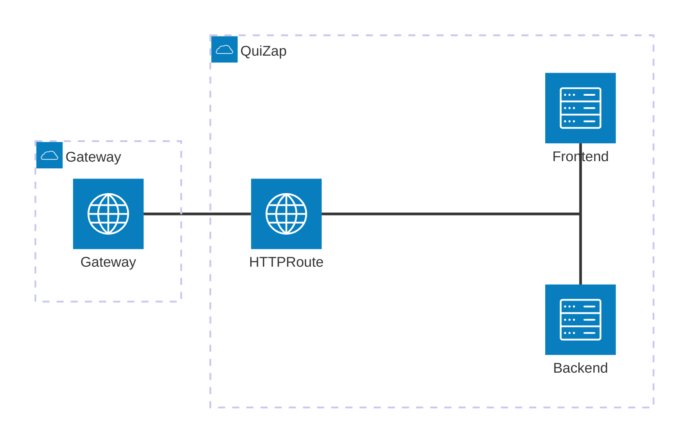

# QuiZap

QuiZap - An online quiz game!

## Components

- [frontend](./frontend): Web user interface, using the [PatternFly](https://www.patternfly.org/)
  design framework. Containerized using [Cloud Native Buildpacks](https://buildpacks.io).
- [backend](./backend): Backend service, using the [Gin](https://github.com/gin-gonic/gin) web
  framework. Containerized using [ko](https://ko.build).

Other components deployed using the [GitOps Deployment repo](https://github.com/adambkaplan/quizap-deployments.git)

## Development Guide

Follow the [Development Guide](./DEVELOPMENT.md) to build and test the application locally.
